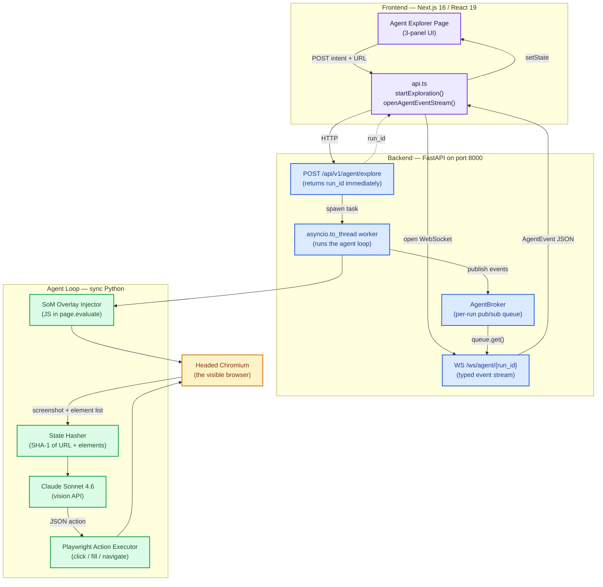
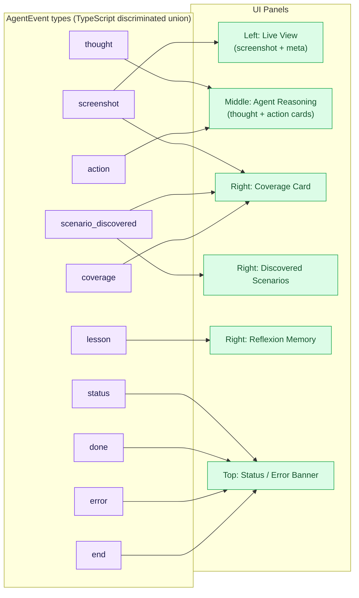
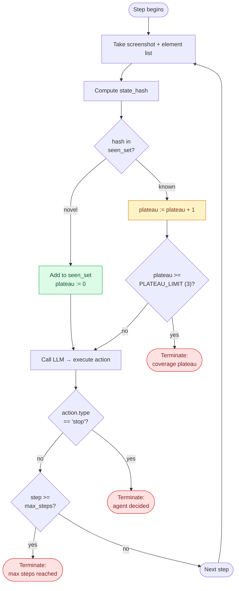
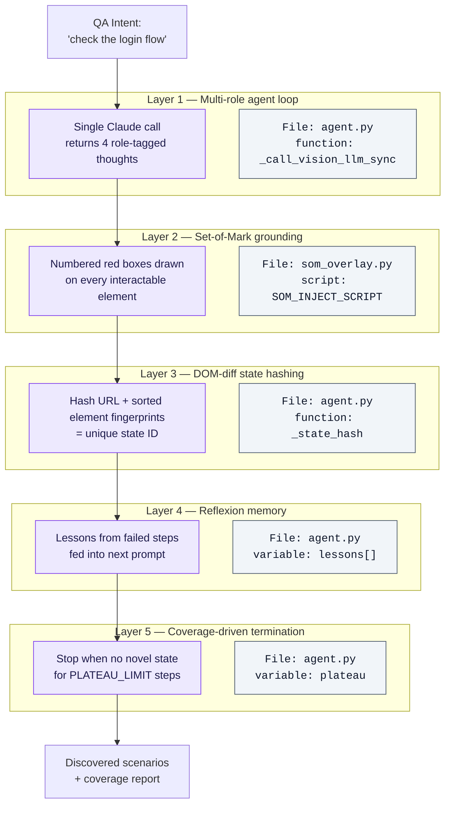
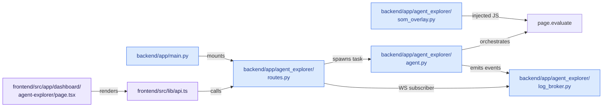

# Agent Explorer — Architecture Diagrams

Companion to [08-agent-explorer.md](08-agent-explorer.md). All diagrams use Mermaid — they render directly in GitHub, VS Code (with Mermaid plugin), and most modern Markdown viewers.

---

## 1. High-Level System Architecture

How the three layers talk to each other when the QA clicks **Run Agent**.



---

## 2. One Agent Iteration — Sequence Diagram

Exactly what happens in a single step of the loop. Repeat 3–12 times until termination.

```mermaid
sequenceDiagram
    autonumber
    participant Loop as Agent Loop
    participant Page as Chromium Page
    participant SoM as SoM Overlay
    participant Claude as Claude Sonnet 4.6
    participant Broker as AgentBroker
    participant UI as React UI (via WS)

    Loop->>Page: wait_for_load_state(networkidle)
    Loop->>SoM: page.evaluate(SOM_INJECT_SCRIPT)
    SoM->>Page: inject numbered red boxes
    SoM-->>Loop: elements[] (id, selector, bbox, text)

    Loop->>Page: screenshot (PNG, 1280x800)
    Page-->>Loop: bytes

    Loop->>Loop: state_hash = SHA1(url + sorted(elements))
    Loop->>Loop: novel = hash not in seen_set

    Loop->>Broker: publish "screenshot" event
    Broker->>UI: stream screenshot + b64 + novel_state

    Loop->>Claude: messages.create(model=sonnet-4-6,<br/>image=screenshot,<br/>text=intent+history+lessons+elements)
    Claude-->>Loop: JSON { thought_planner, thought_actor,<br/>thought_observer, thought_critic, action }

    Loop->>Broker: publish 4 "thought" events (one per role)
    Broker->>UI: stream colored thought cards

    alt action.type == "click" or "fill"
        Loop->>Page: locator(elements[id].selector).click() / .fill(value)
        Page-->>Loop: success / timeout
    else action.type == "discover_scenario"
        Loop->>Broker: publish "scenario_discovered"
        Broker->>UI: add scenario card
    else action.type == "complete_goal"
        Loop->>Broker: publish "coverage"
        Broker->>UI: tick sub-goal off list
    else action.type == "stop"
        Loop->>Broker: publish "done"
        Note over Loop: terminate
    end

    Loop->>Broker: publish "action" event
    Broker->>UI: stream action result

    alt novel == false AND plateau >= 3
        Loop->>Broker: publish "done" (coverage plateau)
        Note over Loop: terminate (novelty)
    end
```

---

## 3. Event Flow — What the WebSocket Carries

Every event the UI can receive, with the panel that renders it.



---

## 4. Coverage-Driven Termination

The novel termination condition (layer 5 of the novelty stack).



---

## 5. The Five Novelty Layers — Where Each Lives in Code

Maps every novelty claim to the exact file + technique. Use this slide when the panel asks "show me where each contribution is in your codebase".



---

## 6. File Map — Where to Point on Demo Day

If the panel asks to see the code, navigate in this order:



---

## How to render these diagrams

| Environment | What to do |
|---|---|
| **GitHub** | Renders automatically on push — no plugin needed |
| **VS Code** | Install the "Markdown Preview Mermaid Support" extension, then `Ctrl+Shift+V` |
| **For PP1 slides** | Open in GitHub → right-click each diagram → "Save image as…" → drop the PNG into your slide deck |
| **Live demo** | Open this file in VS Code preview pane; flip to it when the panel asks "show me the architecture" |
